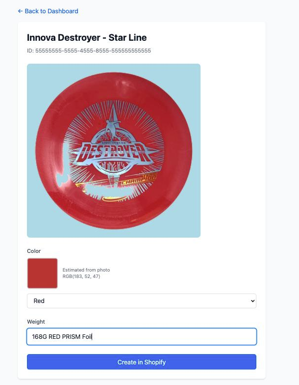

# Disc Golf Shopify Integration

A complete CQRS + Event Sourcing system for managing disc golf inventory on Shopify. Built with Next.js, TypeScript, SQLite, and follows the Adam Dymitruk / Martin Dilger event sourcing approach.

## Screenshot

<p align="center">
  
</p>

The product detail screen after both background jobs have run: the disc has been
centered on the light blue canvas by the image processing job, and its color has
been estimated from the original photo and matched to an available Shopify color.
Once a weight is entered, the variant can be created.

> Screenshot taken against a throwaway database with sample data.

## Architecture Overview

### Components

1. **NextJS Web Application** - User interface and API endpoints
2. **Background Processor** - Async jobs for color estimation and Shopify integration
3. **SQLite Databases** - Event store per user + system database

### Key Features

- Event-sourced architecture with full event replay
- JWT-based authentication for users
- API key authentication for background processor
- Automatic color estimation from photos
- Unique variant generation with weight tracking
- Retry logic for failed Shopify operations (up to 5 attempts)

## Getting Started

### Prerequisites

- Node.js 18+
- npm or yarn
- Shopify store with Admin API access

### 1. Shopify Setup

1. Go to your Shopify Admin → Settings → Apps and sales channels → Develop apps
2. Create a new app
3. Configure Admin API scopes:
   - `read_products`
   - `write_products`
   - `write_files`
   - `read_locations`
   - `write_inventory`
4. Install the app and copy the access token

### 2. Generate Secrets

```bash
# JWT Secret
openssl rand -base64 32

# API Key for background processor
openssl rand -base64 32
```

### 3. Install Dependencies

```bash
# NextJS app
cd nextjs-app
npm install

# Background processor
cd ../background-processor
npm install
```

### 4. Configure Environment

**nextjs-app/.env**
```env
DATABASE_PATH=./data/system.db
USER_DATABASES_PATH=./data/users

JWT_SECRET=<your-generated-jwt-secret>
JWT_EXPIRATION=7d

BACKGROUND_PROCESSOR_API_KEY=<your-generated-api-key>

SHOPIFY_SHOP_DOMAIN=your-store.myshopify.com
SHOPIFY_ACCESS_TOKEN=<your-shopify-admin-token>
SHOPIFY_API_VERSION=2024-10

PORT=3000
```

**background-processor/.env**
```env
NEXTJS_API_URL=http://localhost:3000
NEXTJS_API_KEY=<same-api-key-as-above>

POLLING_INTERVAL_MS=5000

SHOPIFY_SHOP_DOMAIN=your-store.myshopify.com
SHOPIFY_ACCESS_TOKEN=<your-shopify-admin-token>
SHOPIFY_API_VERSION=2024-10

OPENAI_API_KEY=<your-openai-api-key>
OPENAI_IMAGE_MODEL=gpt-image-2
IMAGE_BACKGROUND_HEX=#ADD8E6
IMAGE_CANVAS_SIZE=1024
IMAGE_MARGIN_PX=48
```

### 5. Run the Applications

**Development:**

```bash
# Terminal 1: NextJS app
cd nextjs-app
npm run dev

# Terminal 2: Background processor
cd background-processor
npm run dev
```

**Production:**

```bash
# NextJS app
cd nextjs-app
npm run build
npm start

# Background processor
cd background-processor
npm run build
npm start
```

### 6. First Time Setup

1. Navigate to http://localhost:3000
2. Create your admin account (first user)
3. You're ready to start creating products!

## Usage

### Admin Workflow

1. **Create Restocker Accounts**
   - Login as admin
   - Click "Create User" (if implemented in UI)
   - Provide email and temporary password
   - Restocker must change password on first login

### Product Creation Workflow

1. **Select Product**
   - Click "Create Product"
   - Search/select Shopify product from dropdown

2. **Capture Photo**
   - Take photo or upload from gallery
   - Photo is stored in event store

3. **Color & Weight**
   - Background processor estimates color automatically
   - Review/adjust color in dropdown
   - Enter weight (e.g., "168G RED PRISM Foil")

4. **Create**
   - Click "Create in Shopify"
   - Background processor creates variant with:
     - Unique weight (appends 2, 3, etc. if duplicate)
     - Selected color
     - Uploaded photo
     - Inventory quantity: 1

## API Endpoints

### Authentication

- `POST /api/auth/register` - Create first admin (one-time)
- `POST /api/auth/login` - User login
- `POST /api/auth/change-password` - Change password
- `POST /api/admin/create-user` - Create restocker (admin only)

### Commands

- `POST /api/commands/begin-create-product`
- `POST /api/commands/record-product-color`
- `POST /api/commands/finish-create-product`
- `POST /api/commands/record-product-created-in-shopify` (API key only)
- `POST /api/commands/record-product-failed-in-shopify` (API key only)
- `POST /api/commands/record-product-image-processed` (API key only)
- `POST /api/commands/record-product-image-processing-failed` (API key only)

### Queries

- `GET /api/queries/shopify-products` - List Shopify products
- `GET /api/queries/user-products` - User's products
- `GET /api/queries/product-state` - Product status
- `GET /api/queries/product-image` - Product photo (`?variant=original|processed`, defaults to `original`)
- `GET /api/queries/products-needing-color-estimation` (API key only)
- `GET /api/queries/products-needing-image-processing` (API key only)
- `GET /api/queries/products-to-create-in-shopify` (API key only)
- `GET /api/queries/product-details-for-shopify` (API key only)

## Database Schema

### System Database (`data/system.db`)

```sql
CREATE TABLE users (
    id TEXT PRIMARY KEY,
    email TEXT UNIQUE NOT NULL,
    password_hash TEXT NOT NULL,
    role TEXT NOT NULL CHECK(role IN ('admin', 'restocker')),
    must_change_password INTEGER NOT NULL DEFAULT 0,
    created_at INTEGER NOT NULL
);
```

### User Event Store (`data/users/{user-uuid}.db`)

```sql
CREATE TABLE events (
    id INTEGER PRIMARY KEY AUTOINCREMENT,
    aggregate_id TEXT NOT NULL,
    event_type TEXT NOT NULL,
    event_data TEXT NOT NULL,  -- JSON
    photo_blob BLOB,            -- Only for BeginProductCreated
    timestamp INTEGER NOT NULL,
    version INTEGER NOT NULL
);
```

## Event Types

1. **BeginProductCreated** - Product creation started (carries the photo blob)
2. **ColorEstimated** - Color estimated by background processor
3. **ColorSetV2** - Estimated RGB matched to an available Shopify color name
4. **ProductWeightSet** - Weight entered by user
5. **ProductReadyToBeCreated** - Ready for Shopify creation
6. **ProductCreated** - Successfully created in Shopify
7. **ProductCreateFailed** - Failed to create (with retry count)
8. **ProductImageProcessed** - Disc centered on the light blue canvas (carries the processed blob)
9. **ProductImageProcessingFailed** - Image processing failed (with retry count)
10. **ShopifyTokenReceived** - OAuth token stored on the `shopify-auth` aggregate

## Product States

- `data-entry` - User is entering information
- `creating` - Being created in Shopify
- `created` - Successfully created
- `failed` - Failed after 5 attempts

## Background Processor Jobs

### Job 1: Color Estimation

1. Polls for products without color
2. Downloads product image
3. Resizes to 100x100
4. Calculates average RGB
5. Records color via command API

### Job 2: Image Processing

1. Polls for products with a photo but no processed image
2. Reads the **original** photo (never the processed one — Job 1 depends on it)
3. Sends it to OpenAI `images/edits` (`gpt-image-2`) to replace the surroundings with light blue
4. Uses `sharp` to trim to the disc's bounding box and re-center it on an exact
   `IMAGE_CANVAS_SIZE` canvas filled with `IMAGE_BACKGROUND_HEX`
5. Records `ProductImageProcessed` with the resulting PNG
6. Retries up to 5 times, recording `ProductImageProcessingFailed` each time

The generative step handles background replacement only; centering, canvas size,
margin, and the exact background color are done deterministically in `sharp`, so
they do not depend on how precisely the model framed the image.

### Job 3: Shopify Creation

1. Polls for products ready to create **and already image-processed**
2. Maps RGB to color name
3. Ensures unique weight variant
4. Uploads the **processed** image to Shopify
5. Creates variant with photo, color, weight
6. Records success/failure
7. Retries up to 5 times on failure

Note: because Shopify creation waits for the processed image, a product whose
image processing fails all 5 attempts stays in `data-entry` and is never created.
The product page surfaces this.

## Development Notes

### CQRS + Event Sourcing Principles

- **Commands modify state** → emit events
- **Events are immutable** → append-only log
- **Queries replay events** → compute current state
- **No read model optimization** → full replay every time (MVP)

### Event Replay Example

```typescript
function replayEvents(events: Event[]): ProductState {
  let state = { status: 'not-started' };
  for (const event of events) {
    switch (event.eventType) {
      case 'BeginProductCreated':
        state = { ...state, status: 'data-entry', ... };
        break;
      // ... handle other events
    }
  }
  return state;
}
```

## Troubleshooting

### Database Issues

- Databases are created automatically on first run
- Located in `nextjs-app/data/` directory
- One `system.db` + one `{uuid}.db` per user

### Shopify API Errors

- Check API token has correct scopes
- Verify product exists in Shopify
- Check rate limits (background processor will retry)

### Background Processor Not Running

- Ensure API key matches in both .env files
- Check NextJS app is running and accessible
- Verify NEXTJS_API_URL is correct

## Future Enhancements

- Optimized read models (projections)
- Bulk upload
- Inventory management (mark as sold)
- Analytics dashboard
- Mobile native app
- Advanced color detection (ML)

## Tech Stack

- **Frontend:** Next.js 14+, React, TypeScript, Tailwind CSS
- **Backend:** Next.js API Routes, Node.js
- **Database:** SQLite (better-sqlite3)
- **Authentication:** JWT, bcrypt
- **Image Processing:** Sharp
- **E-commerce:** Shopify Admin API

## License

MIT

## Support

For issues and questions, please refer to the original specification document.
